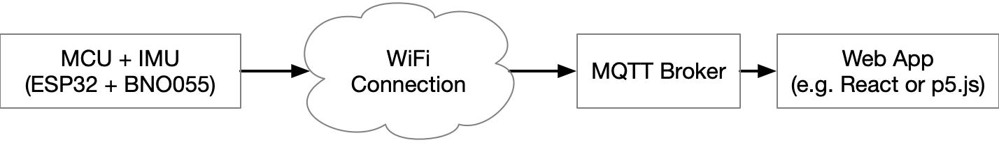
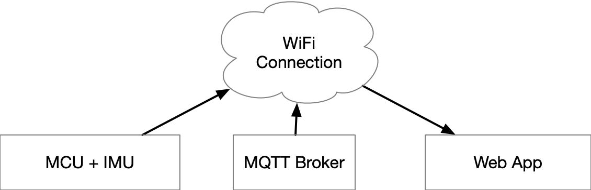
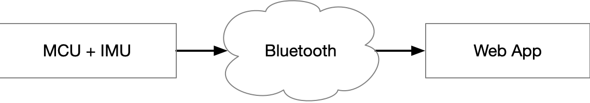

# IMU Tools

This project contains tools for sending IMU data over a WiFi or Bluetooth
connection from an ESP, and consuming it in a web page.

it contains these components:

- A MicroPython program (in `./pyboard`) that runs on an ESP8266 or ESP32. It publishes sensor
  data from a connected to BNO055 IMU, a simulated IMU, to an MQTT connection,
  or the serial port.

- Web pages (in the `web` directory) that display IMU data as graphs, charts,
  and 3D models using React, p5.js, Highcharts, and D3. These serve as examples
  of how to consume the IMU data.

- A fleet management dashboard (also in the `web` directory) that displays a
  list of connected device, with frame rates.

- Command-line tools (in the `scripts` directory, and invoked via `poetry`)
  to report, simulate, and measure the sample rate of IMU data, and relay it to
  a named port.

- Additional command-line scripts for managing MicroPython/ESP development.

- An npm package [imu-tools npm
  package](https://www.npmjs.com/package/imu-tools) that that can be included in
  a web page in order to subscribe to an MQTT broker that is relaying data in
  the format provided by the tools in this directory.

- An experimental demonstration of rigging a Blender model to IMU output.

The ESP program in this repository sends data over MQTT/WiFi. The rest of the
code in this repository is also designed to work\ with
<https://github.com/osteele/Arduino-BLE-IMU>, which uses Bluetooth Low Energy
(BLE) connection instead.

## Modes of Operation

 Local MQTT Gateway. An ESP32 connects via
WiFi to an MQTT broker running on a developer laptop. A web app, such as a React
or p5.js application, can connect to this broker to read the sensor data from
all the IMUs on the network.

. This architecture MQTT Gateway allows a
web page to draw information from many MCUs.

. It also allows several computers to subscribe to data from the
same sensors. This is useful for an installation.

. Remote MQTT Gateway. The same as above,
but the MQTT gateway can run on a server with greater availability than a
laptop. This has the advantage that multiple laptops can all subscribe to data
from a fleet of sensors. It has the disadvantage that the development machine
must be on the same LAN as the MQTT broker, or it must be remote for less
security and greater latency than a local deployment.

. Alternate ESP firmware, in
<https://github.com/osteele/Arduino-BLE-IMU>, which publishes sensor data via
BLE instead of MQTT. This permits use at lower power levels, without WIFi, and
without the need for an MQTT broker.

Currently, only the Chrome browser supports Web Bluetooth; and, the user has to
manually initiate each BLE connection each time the page is reloaded. This is a
bother during development, and when working multiple devices. As a workaround,
the system can also be used in the mode:

. The BLE -> MQTT Relay is a
command-line application that connects as a Central BLE device to IMU BLE
Peripherals, and relays their sensor data to a (local or remote) MQTT broker.

The Serial -> MQTT Gateway that publishes information from an MCU that is
connected to a computer's serial port, to a local or remote MQTT broker.

## Installation

1. Clone this repo.

2. Either: (1) Follow the instructions
   [here](https://www.notion.so/RabbitMQ-7fd3ba693d924e1e893377f719bb5f14) to
   install RabbitMQ on your computer; or (2) get an MQTT hostname, username, and
   password from your instructor, and use it in the instructions below.

## Flashing the ESP

1. Download a GENERIC image from [MicroPython Downloads](https://micropython.org/download#esp32).
   For example, `esp32-idf3-20191220-v1.12.bin`.

2. Flash the ESP. If you downloaded the image to
   `images/esp32-idf3-20191220-v1.12.bin`, then run:

   ```sh
   ./scripts/flash images/esp32-idf3-20191220-v1.12.bin
   ```

3. Upload the Python source code to the ESP. In a terminal window in this
   directory, run:

   ```sh
   ./scripts/py-upload
   ```

## Viewing the Web Examples

Run `./webserver` to start a web server.

<http://127.0.0.1:8000> displays a directory of web pages in the `web` directory
directory.

<http://127.0.0.1:8000/barchart.html> displays a live bar chart of sensor data.

<http://127.0.0.1:8000/chart.html> uses HighCharts to display another live
graph, that automatically scales the y axis as data arrives.

<http://localhost:8000/3d-model.html> displays the bunny, with its orientation
yolked to the IMU orientation. The model is red before the sensor is minimally
calibrated, and it fades out when sensor data is not being received.

## Bluetooth

<https://github.com/osteele/Arduino-BLE-IMU> is an alternative to the
MicroPython program in `./pyboard`, that sends IMU data over a Bluetooth Low
Energy (BLE) connection instead of MQTT.

Follow the instructions in that repository to upload it to an ESP32.

There are two means of using this data:

1. In a browser. In Chrome, any of the demos (or a program that uses the
   imu-tools npm package) will include a “BLE Connect". This opens the browser's
   Bluetooth connection dialog. The button disappears once a device has been
   connected; press the `b` key to connect a second (and third, etc.) device.
2. Run the BLE->MQTT gateway.
   1. Once: in the command line, run `npm install`.
   2. Each time you start a development session: run `npm run ble2mqtt`.

## Command-Line Testing

`poetry run sub` runs an MQTT client that subscribes to IMU messages that are
sent to the MQTT broker, and relays them to the terminal.

`poetry run pub` publishes an MQTT message. The message is a simulated sensor
sample.

`./scripts/simulate` simulates a device. It continuously publish messages from a
simulated IMU until the user kills (^C) the script. (This is the same as the
`--continuous` option to `poetry run pub`.) The simulated sensor readings change
over time.

`./scripts/simulate --help` gives a list of command-line options. Use
`--device-id` to simulate a particular ID; you can use this to run multiple
simulations, in different terminals, with different ids.

## MicroPython development

`./scripts/py-upload` copies the code in `pyboard` to the attached ESP, and then
reboots the board.

`./scripts/py-repl` opens an [rshell](https://github.com/dhylands/rshell#rshell)
REPL to the attached ESP. Press `⌃X` to exit the `./scripts/py-repl` command.

`./scripts/serial-term` is an alternative to `./scripts/py-repl`, that uses the
[GNU `screen` command](https://www.gnu.org/software/screen/) instead of
`rshell`. `serial-term` connects to the board more quickly than `py-repl`.
Consult the documentation for `screen` to see how to exit this command.

[MicroPython Development
Notes](https://paper.dropbox.com/doc/MicroPython-Development--Ai1pmnXzhBdkxZ6SuEPMTDiDAg-sAf2oqgmH5yIbmx27kZqs)
contains notes on developing MicroPython on the ESP.

While running a REPL on the board, press `⌃D` to reboot the board. (`⌃` is the
control character. Hold it down while the `D` is pressed, and then release them
both.)

## Blender

As a proof of concept, IMU data can be used to control the orientation of a
rigged joint in Blender.

In a terminal, run: `./scripts/mqtt2pipe`

In another terminal, launch Blender with the `--python blender/motion.py` option:

`/Applications/Blender.app/Contents/MacOS/Blender model.blend --python blender/motion.py`

Note: If the pipe buffer fills (for example, because Blender is closed), the
`mqtt-sub` process will hang. You will need to force quit it (^C) and launch it
again.

## Firmware Operation

An ESP that is running the firmware in this directory connects to a WiFi network
and an MQTT broker, and continuously publishes MQTT messages to the
`imu/${device_id}` topic, where `${device_id}` is a unique device id for the
ESP. (It is currently the lowercase hexadecimal representation of the device's
MAC address.) The message payload is a JSON string with properties whose names
are the values of the IMU sensors, fused data, and other data: accelerometer,
gyroscope, magnetometer, euler, quaternion, calibration, temperature. The
message also includes a "timestamp" value, which is the millisecond counter.
This can be used to compute the relative time between samples.

It periodically prints the sample rate to the serial port.

It can optionally be configured to instead send the sensor data.

The serial port format is compatible with
[osteele/microbit-sensor-relay](https://github.com/osteele/microbit-sensor-relay).

## References

- [Paho MQTT](https://pypi.org/project/paho-mqtt/)
- [MicroPython](http://docs.micropython.org/en/latest/)
- [MicroPython MQTT](https://github.com/micropython/micropython-lib/tree/master/umqtt.simple)

## Credits

`BNO055.py` and `functools.py` are adapted from Radomir Dopieralski's
[`deshipu/micropython-bno055`](https://github.com/deshipu/micropython-bno055).

This uses [MicroPython](https://micropython.org) and Paho MQTT, and uses
[rshell](https://github.com/dhylands/rshell).
